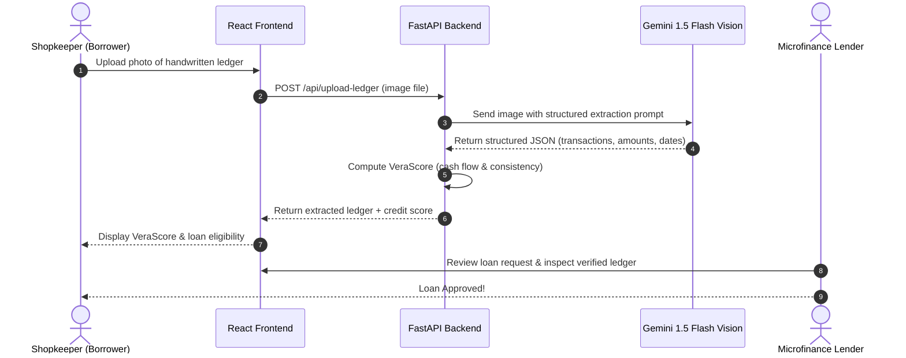

# VeraFi 📓➡️💳

> **AI-Powered Microfinance for the Credit-Invisible**  
> *A Hackathon Project by CSE Undergraduates bridging the gap between handwritten paper ledgers and fair microloans using AI.*

---

[](https://python.org)
[](https://fastapi.tiangolo.com)
[](https://reactjs.org)
[](https://ai.google.dev/)
[](https://opensource.org/licenses/MIT)

---

## 💡 Inspiration & Problem

In India and many developing economies, millions of small tea stalls, vegetable vendors, and local *kirana* store owners record their daily business in handwritten paper notebooks called **Bahi-Khata** or **Khatabook**. 

- **The Problem**: When they need a small loan (e.g., ₹10,000 to ₹50,000) to buy inventory or expand, traditional banks reject them because they don't have formal bank statements, tax returns, or a credit score (CIBIL). They are labeled **"credit invisible"**.
- **The Consequence**: They are forced to turn to informal moneylenders who charge predatory interest rates (often 5% to 10% per month).
- **Our Idea**: What if an unbanked shopkeeper could simply snap a photo of their handwritten ledger, and an AI model could digitize their transactions, calculate an alternative credit score, and help them qualify for low-cost microfinance?

That is **VeraFi**.

---

## ✨ What VeraFi Does

1. 📸 **Upload Ledger Photo**: The borrower snaps a photo of their physical *khatabook* page or paper receipt.
2. 🧠 **AI Handwriting Extraction**: We use **Google Gemini 1.5 Flash Vision** to read messy handwriting, extract dates, customer names, debit/credit (*jama/udhar*) amounts, and calculate net balances into clean JSON.
3. 📊 **VeraScore Credit Assessment**: Our Python backend analyzes the cash-flow velocity, daily customer turnover, and repayment cadence to compute a credit score from **300 to 850**.
4. 🏦 **Lender Dashboard**: Microfinance lenders can see the applicant's profile, view the extracted digital transactions side-by-side with the original image, and make quick, informed microloan approvals.

---

## 🛠️ Tech Stack (Beginner-Friendly & Fast)

- **Frontend**: **React** (Vite + Tailwind CSS) — Clean, responsive, single-page application.
- **Backend**: **Python (FastAPI)** — Lightweight and fast REST API.
- **AI & Vision**: **Google Gemini 1.5 Flash API** — Fast multimodal vision processing to parse handwritten ledger images into structured data.
- **Database**: **SQLite** — Zero-setup local database for storing users, uploaded ledgers, and loan requests.

---

## 📁 Project Architecture

We kept the architecture simple and modular so it is easy to run and demo during the hackathon:

```text
VeraFi/
├── backend/
│   ├── main.py               # FastAPI server and API endpoints
│   ├── ai_extractor.py       # Gemini Vision prompt & OCR parsing logic
│   ├── credit_scorer.py      # VeraScore algorithm logic
│   ├── database.py           # Simple SQLite database connection
│   └── requirements.txt      # Python dependencies
│
├── frontend/
│   ├── src/
│   │   ├── components/
│   │   │   ├── Navbar.jsx
│   │   │   ├── UploadSection.jsx     # Snap / upload ledger photo
│   │   │   ├── LedgerViewer.jsx      # Side-by-side image & extracted table
│   │   │   ├── ScoreCard.jsx         # VeraScore display & breakdown
│   │   │   └── LenderDashboard.jsx   # Simple loan review portal
│   │   ├── App.jsx
│   │   └── main.jsx
│   ├── package.json
│   └── vite.config.js
│
├── sample_data/              # Sample test images for judges & demo
│   ├── sample_khatabook_1.jpg
│   └── sample_receipt_1.jpg
│
├── .env.example              # Sample environment keys
└── README.md
```

---

## 🔄 User Workflow



---

## ⚡ Quickstart Guide (Run in 3 Minutes)

### Prerequisites
- **Python 3.10+**
- **Node.js 18+** & `npm`
- A free **Google Gemini API Key** from [Google AI Studio](https://aistudio.google.com/)

---

### Step 1: Clone the Repo
```bash
git clone https://github.com/krishnagupta1710q-cmyk/VeraFi.git
cd VeraFi
```

---

### Step 2: Backend Setup
```bash
cd backend

# Create virtual environment
python3 -m venv venv
source venv/bin/activate    # On Windows: venv\Scripts\activate

# Install dependencies
pip install -r requirements.txt

# Set your Gemini API key
export GEMINI_API_KEY="your_api_key_here"   # On Windows PowerShell: $env:GEMINI_API_KEY="your_api_key_here"

# Start the server
uvicorn main:app --reload --port 8000
```
Backend will be running at `http://localhost:8000` (Swagger docs at `http://localhost:8000/docs`).

---

### Step 3: Frontend Setup
In a new terminal:
```bash
cd frontend

# Install dependencies
npm install

# Start Vite dev server
npm run dev
```
Open `http://localhost:5173` in your browser!

---

## 📈 How the VeraScore is Calculated

Because informal borrowers lack formal credit history, our algorithm evaluates 4 simple, practical pillars:

$$\text{VeraScore} = (\text{Volume Score} \times 0.35) + (\text{Consistency Score} \times 0.35) + (\text{Customer Diversity} \times 0.20) + (\text{Repayment Cadence} \times 0.10)$$

1. **Transaction Volume**: Average daily cash inflow vs. requested loan amount.
2. **Consistency**: Frequency of regular business days per week.
3. **Customer Diversity**: Number of unique paying customers (reduces risk of depending on a single buyer).
4. **Repayment Cadence**: Timeliness of informal credit collections recorded in the notebook.

Result: A transparent score between **300 and 850** with an explanation of risk factors.

---

## 🧗 Challenges We Faced & What We Learned

- **Deciphering Messy Regional Handwriting**: Standard OCR models struggled with mixed English/Hindi/regional script and shorthand numbers. Switching to multimodal prompts with **Gemini 1.5 Flash** dramatically improved recognition.
- **Handling Incomplete Data**: Shopkeepers don't always write down year or cents. We built fallback normalization rules to handle missing dates and partial entries.
- **Keeping It Simple**: We initially considered complex Web3 and multi-service architectures, but focused on building an intuitive, working prototype that solves the actual human problem.

---

## 🔮 What's Next (Future Roadmap)

- 📱 **WhatsApp Bot**: Allow merchants to send ledger pictures directly over WhatsApp without opening a website.
- 🗣️ **Regional Voice Interface**: Voice assistant to guide first-time digital users in their local language.
- 🏦 **Direct UPI/Bank Payouts**: Integration with sandbox banking APIs for instant loan disbursement.

---

## 👥 Team & Acknowledgments

Developed with ❤️ for the Hackathon by CSE undergraduates:
- **Krishna Gupta** ([@krishnagupta1710q-cmyk](https://github.com/krishnagupta1710q-cmyk))
- **Janamjai** ([@Jnmj-dev](https://github.com/Jnmj-dev))

---

## 📄 License
This project is open source under the [MIT License](LICENSE).
