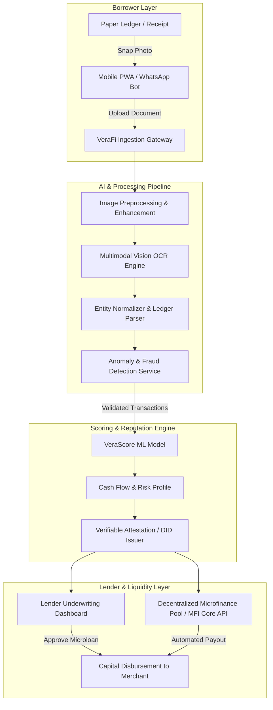

# VeraFi 🌐🌱

> **AI-Powered Microfinance & Verified Financial Reputation**  
> *Bridging informal economies to fair microcredit by transforming paper ledgers, receipts, and cash memos into verified, audit-ready financial identities.*

---

[](https://opensource.org/licenses/MIT)
[](https://python.org)
[](https://fastapi.tiangolo.com)
[](https://nextjs.org)
[](https://typescriptlang.org)
[](#)

---

## 📌 Executive Summary

Over **1.4 billion adults** globally lack access to formal financial services. Micro-entrepreneurs, roadside vendors, agricultural smallholders, and unbanked merchants conduct billions of dollars in daily transactions, yet record them exclusively in handwritten physical notebooks (*khatabook* / *bahi-khata*), paper receipts, and cash invoices. 

Because traditional credit bureaus (e.g., CIBIL, Experian) demand digitized bank statements and formal collateral, these viable entrepreneurs remain **"credit invisible"**—leaving them vulnerable to predatory local moneylenders charging 50%–120%+ APR.

**VeraFi** is an AI-driven decentralized microfinance infrastructure that bridges this gap. By utilizing multimodal computer vision and specialized financial language models, VeraFi ingests photos of informal paper records, verifies cash flow integrity, computes an objective credit score (**VeraScore™**), and produces tamper-evident digital attestations that institutional lenders and microfinance institutions (MFIs) can trust.

---

## 🚀 Key Features

- 📷 **Multimodal Paper Ledger Ingestion**
  - Instant camera and image upload for handwritten ledgers, faded receipts, invoices, and notebook pages.
  - Multi-language and regional script support (Hindi, Spanish, Swahili, Arabic, Bengali, etc.).
- 🧠 **Intelligent Financial OCR & Entity Extraction**
  - Recognizes dates, customer names, debit/credit entries, outstanding balances, and inventory turnover.
  - Auto-structures unstructured, messy handwriting into standardized double-entry accounting records.
- 🛡️ **Cross-Validation & Fraud Detection Engine**
  - Mathematical anomaly detection (detects altered ink, overwritten digits, inconsistent running balances).
  - Cross-references supplier receipts against merchant claims to flag synthetic transaction inflation.
- 📈 **VeraScore™ (Alternative Credit Engine)**
  - Computes holistic creditworthiness based on cash-flow velocity, repayment consistency, supplier relationship longevity, and seasonal resilience.
  - Generates transparent, explainable credit profiles for loan underwriters.
- ⛓️ **Decentralized Reputation & Verifiable Credentials**
  - Generates cryptographic proofs and tamper-proof reputation attestations (EAS / Soulbound / DID).
  - Borrowers maintain sovereignty over their financial records without lock-in to a single platform.
- 📱 **Low-Barrier Borrower Experience**
  - Designed for mobile-first and low-bandwidth environments.
  - WhatsApp and Telegram bot integration for one-click photo submissions and audio guidance.
- 🏦 **MFI & Lender Underwriting Dashboard**
  - Real-time loan portfolio monitoring, risk exposure breakdown, automated loan origination, and repayment tracking.

---

## 🏗️ System Architecture



---

## 📁 Repository Structure

```text
VeraFi/
├── apps/
│   ├── web/                    # Next.js 14 frontend (Borrower portal & Lender dashboard)
│   └── bot/                    # WhatsApp / Telegram ingestion gateway
├── services/
│   ├── api/                    # FastAPI core backend service
│   │   ├── app/
│   │   │   ├── api/            # Route controllers & endpoints
│   │   │   ├── core/           # Configuration, security, database sessions
│   │   │   ├── models/         # SQLAlchemy ORM schemas
│   │   │   ├── schemas/        # Pydantic data schemas
│   │   │   └── services/       # Business logic
│   ├── ocr_pipeline/           # Multimodal vision & handwriting extraction
│   └── scoring_engine/         # VeraScore calculation & risk analysis algorithms
├── packages/
│   ├── contracts/              # Solidity contracts for attestations & escrow
│   └── shared-types/           # Shared TypeScript interfaces
├── docs/                       # Architectural specs, API documentation & whitepaper
├── tests/                      # Unit, integration, and end-to-end tests
├── docker-compose.yml          # Local orchestration
├── .env.example                # Sample environment variables
└── README.md                   # Project documentation
```

---

## 💻 Tech Stack

| Domain | Technologies |
|---|---|
| **Frontend** | [Next.js 14](https://nextjs.org/) (App Router), [TypeScript](https://www.typescriptlang.org/), [Tailwind CSS](https://tailwindcss.com/), [Shadcn UI](https://ui.shadcn.com/), [Lucide](https://lucide.dev/) |
| **Backend API** | [FastAPI](https://fastapi.tiangolo.com/) (Python 3.10+), [Pydantic v2](https://docs.pydantic.dev/), [Uvicorn](https://www.uvicorn.org/) |
| **Database & Cache** | [PostgreSQL](https://www.postgresql.org/) (with pgvector), [Redis](https://redis.io/), [SQLAlchemy](https://www.sqlalchemy.org/) |
| **AI / Computer Vision** | Multimodal LLMs (Gemini Vision / GPT-4o), TrOCR, OpenCV, LayoutLMv3 |
| **Web3 & Attestations** | [EAS (Ethereum Attestation Service)](https://attest.org/), [Ethers.js](https://docs.ethers.org/) / [Viem](https://viem.sh/), Polygon / Base |
| **DevOps & Tooling** | Docker, Docker Compose, GitHub Actions, Pytest, ESLint |

---

## ⚡ Getting Started

### Prerequisites

Ensure you have the following installed on your local machine:
- [Git](https://git-scm.com/)
- [Node.js](https://nodejs.org/) (v18.0.0 or higher) & [pnpm](https://pnpm.io/) or `npm`
- [Python](https://www.python.org/) (v3.10 or higher)
- [Docker](https://www.docker.com/) & Docker Compose (optional, for containerized run)

---

### 1. Clone the Repository

```bash
git clone https://github.com/krishnagupta1710q-cmyk/VeraFi.git
cd VeraFi
```

### 2. Environment Configuration

Copy the sample environment configuration:

```bash
cp .env.example .env
```

Fill in your configuration details (e.g. database credentials, AI model API keys).

---

### 3. Backend Setup

```bash
# Navigate to backend API service
cd services/api

# Create and activate a virtual environment
python3 -m venv venv
source venv/bin/activate  # On Windows: venv\Scripts\activate

# Install dependencies
pip install -r requirements.txt

# Run database migrations
alembic upgrade head

# Start development server
uvicorn app.main:app --reload --port 8000
```

The API docs will be accessible at `http://localhost:8000/docs`.

---

### 4. Frontend Setup

```bash
# In a new terminal, navigate to the web application
cd apps/web

# Install dependencies
npm install

# Start development server
npm run dev
```

Visit `http://localhost:3000` to interact with the VeraFi web portal.

---

### 5. Running with Docker Compose

To spin up the database, cache, backend, and frontend together:

```bash
docker-compose up --build
```

---

## 📊 How VeraScore™ Works

The **VeraScore™** (300–850) synthesizes unconventional financial indicators:

$$\text{VeraScore} = w_1 \cdot C_{\text{velocity}} + w_2 \cdot R_{\text{consistency}} + w_3 \cdot D_{\text{depth}} + w_4 \cdot S_{\text{resilience}} - M_{\text{penalty}}$$

- **Cash Flow Velocity ($C_{\text{velocity}}$)**: Ratio of daily inward revenue to working capital needs.
- **Repayment Consistency ($R_{\text{consistency}}$)**: Historical cadence of debt retirement with suppliers and informal lenders.
- **Data Depth ($D_{\text{depth}}$)**: Temporal span and completeness of ledger history.
- **Seasonal Resilience ($S_{\text{resilience}}$)**: Revenue stability across volatile market or agricultural cycles.
- **Mismatch Penalty ($M_{\text{penalty}}$)**: Mathematical inconsistency score flagged by the anomaly detection layer.

---

## 🗺️ Product Roadmap

- [x] **Phase 1: Concept & Architecture Design**
  - Problem discovery, data schema design, and ingestion specification.
- [ ] **Phase 2: Vision & OCR Ledger Extractor**
  - Fine-tuning multimodal prompts for regional bahi-khata and receipt parsing.
  - Automated reconciliation of dual-entry cash books.
- [ ] **Phase 3: VeraScore Engine & Anomaly Detector**
  - Rule-based & ML credit scoring model baseline.
  - Cross-merchant synthetic transaction verification.
- [ ] **Phase 4: WhatsApp Ingestion Gateway**
  - Chatbot enabling merchants to submit pictures with zero app installations.
- [ ] **Phase 5: MFI Integration & Attestation Layer**
  - On-chain attestations (EAS) and lender loan origination dashboard.
  - Pilot testing with regional microfinance institutions.

---

## 🤝 Contributing

Contributions make the open-source community an inspiring place to learn, collaborate, and create. Any contributions to VeraFi are **greatly appreciated**.

1. Fork the Project
2. Create your Feature Branch (`git checkout -b feature/AmazingFeature`)
3. Commit your Changes (`git commit -m 'feat: Add some AmazingFeature'`)
4. Push to the Branch (`git push origin feature/AmazingFeature`)
5. Open a Pull Request

---

## 📄 License

Distributed under the MIT License. See `LICENSE` for more details.

---

## 📬 Contact & Community

- **Project Lead**: Krishna Gupta ([@krishnagupta1710q-cmyk](https://github.com/krishnagupta1710q-cmyk))
- **Repository**: [https://github.com/krishnagupta1710q-cmyk/VeraFi](https://github.com/krishnagupta1710q-cmyk/VeraFi)
- **Inquiries**: For partnerships and MFI pilot programs, reach out via GitHub Issues or contact Krishna Gupta directly.

